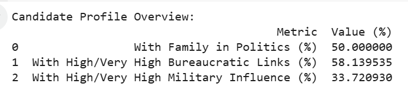
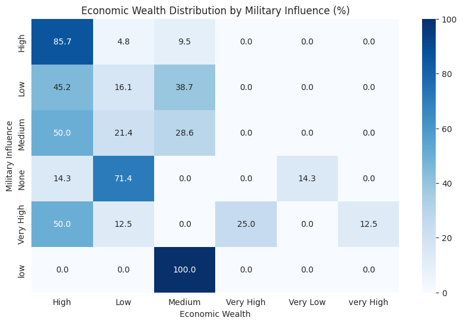
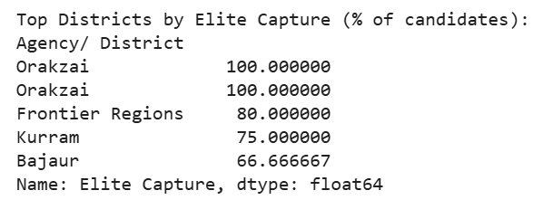
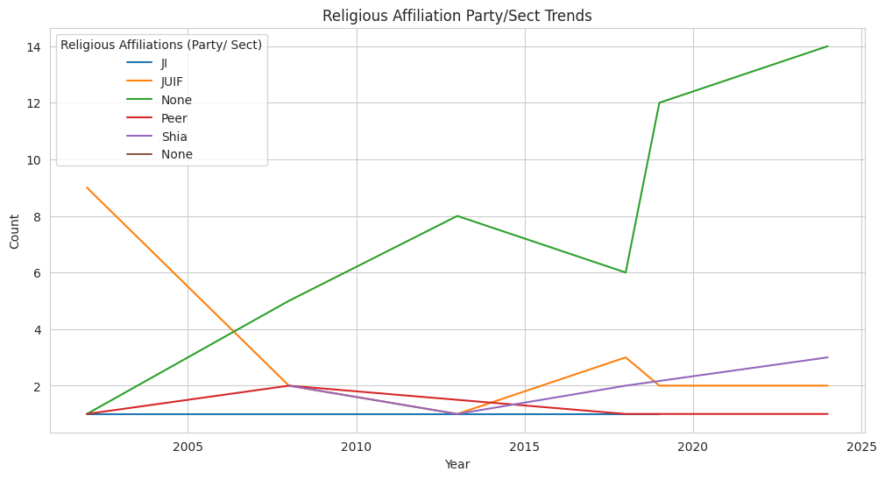
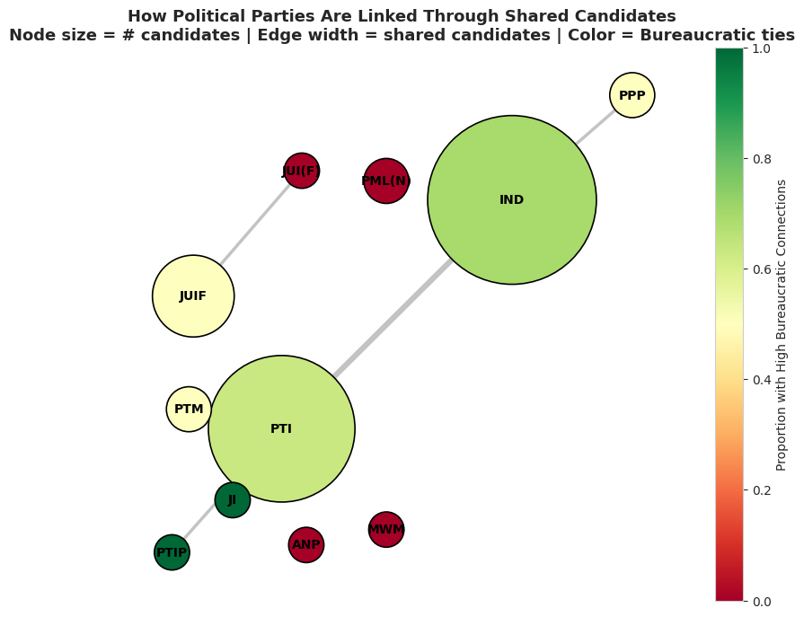

# Election Dataset Analysis (2008–2024)

This project explores **Pakistan’s election dataset** (2008–2024), focusing on candidate backgrounds, elite networks, and party dynamics.  
Using **Python (Pandas, Matplotlib, Seaborn, NetworkX)**, the analysis highlights how family ties, bureaucracy, wealth, and military influence shape political participation in Pakistan.  

## Research Motivation
Elections are not just about votes — they’re about **who gets to participate**.  
This project investigates:
- How “elite-driven” is Pakistan’s political system?  
- How have candidate traits (family, bureaucracy, military, wealth, religion) evolved over time?  
- Which districts show the strongest **elite capture**?  
- How are political parties connected through shared candidates?  

## Key Findings

### Candidate Profiles (Snapshot)


- ~50% have **family ties** in politics  
- ~60% linked to **bureaucracy**  
- ~30% show **military influence**  

### Elite Traits Over Time (2008–2023)
.png)

- Bureaucratic dominance **declined** since 2008  
- Family ties **rebounded** around 2019  
- Military presence remains **steady but significant**  

### Military Influence vs Wealth


- Candidates with **military background** are strongly correlated with **higher wealth levels**  

### District-Level Elite Capture


- A few districts consistently produce **elite-driven candidates**  
- Highlights **geographic concentration of power**  

### Party Representation
.png)

- Independent candidates (**IND**) dominate the landscape  
- PTI has emerged as a **key institutional hub** since 2018  

### Religious Affiliation Trends


- Provides insights into **religion-based candidate dynamics** over elections  

### Party Network Graph


- **IND & PTI** act as central hubs in the political network  
- Smaller parties orbit with limited interconnections  
- **Bureaucratic ties cluster** around larger parties  

## Tech Stack

- **Languages**: Python  
- **Libraries**: Pandas, Matplotlib, Seaborn, NetworkX   

## Repository Structure

```bash
├── notebooks/
│   └── Election_data_analysis.ipynb
├── visualisations/
│   ├── Candidate_Traits_Snapshot.png
│   ├── Elite_Traits_Over_Time_(2008–2023).png
│   ├── Military_Influence_vs_Wealth.png
│   ├── Top_Elite_Capture_Districts.png
│   ├── Party_Representation_(%).png
│   ├── Religious_Affiliation_Trends.png
│   └── Network_Graph_of_Parties.png
├── data/
│   └── Elections_Analysis.xlsx
└── README.md
